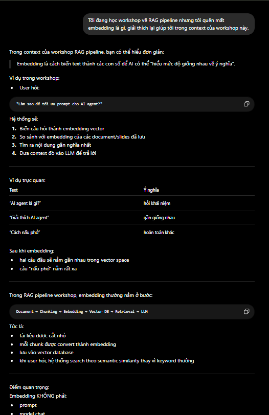
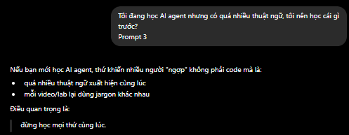
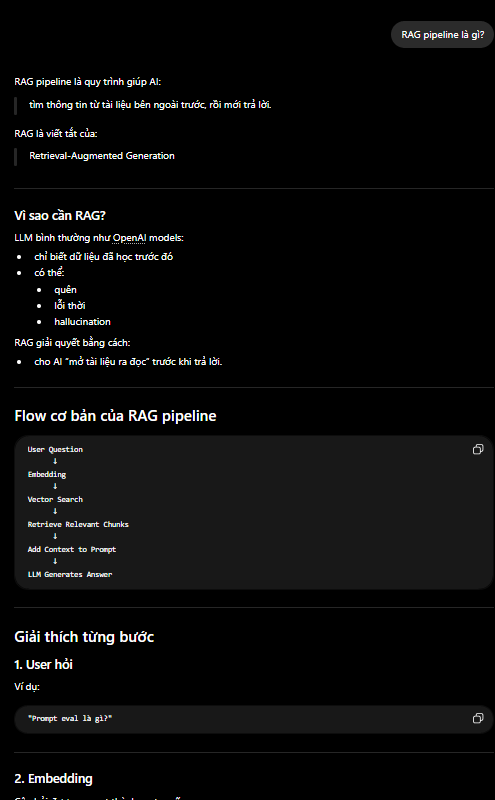

# Template — Evidence Pack


---

# 1. Nhóm và track

**Tên nhóm:** C1
**Track:** Learning Web
**Product/app đã chọn:** LMS AI Learning Assistant

## Build slice đang nghĩ

### Một user:

Sinh viên đang học workshop/lab về RAG Pipeline trong khóa AI thực chiến.

### Một task:

Hỏi AI:

> “Chunking ảnh hưởng thế nào đến retrieval quality?”

### Một AI decision:

AI xác định đây là câu hỏi kiến thức nằm trong phạm vi slide/tài liệu workshop, thực hiện retrieval từ tài liệu liên quan và chọn mode “Giải thích có dẫn nguồn”.

### Một output:

Câu trả lời ngắn gọn, dễ hiểu, có ví dụ minh họa nhỏ, kèm citation tên tài liệu + slide/page liên quan + đoạn trích nguồn ngắn để người học kiểm chứng.

---

# 2. Self-use evidence

Nhóm tự dùng workflow học AI/workshop và ghi lại điểm gãy.

| Observation                                                                                                                           | Screenshot/link                           | Path liên quan | Điều học được                                                                                             |
| ------------------------------------------------------------------------------------------------------------------------------------- | ----------------------------------------- | -------------- | --------------------------------------------------------------------------------------------------------- |
| Khi học workshop AI dài 2–3 tiếng, người học thường quên hoặc không theo kịp các khái niệm vừa được giảng trước đó vài phút.          |                 | Low-confidence | Người học cần AI summarize + contextual recall thay vì chỉ chatbot hỏi đáp chung chung.                   |
| Khi tự tìm hiểu khái niệm AI bằng Google hoặc AI chatbot, kết quả thường quá chung chung và không bám sát nội dung khóa học/workshop. |  | Failure        | AI assistant cần grounded retrieval từ chính slide/tài liệu khóa học để giảm hallucination và tăng trust. |
| Người học gặp khó khăn với nhiều thuật ngữ chuyên ngành AI và không biết nên tìm từ khóa nào trước.                                   |               | Correction     | Cần mode giải thích đơn giản + ví dụ ngắn + citation để hỗ trợ onboarding học viên mới.                   |

---

# 3. User / review / social evidence

| Quote / review / observation                                                                   | Nguồn                | User là ai?    | Pain/failure mode                              |
| ---------------------------------------------------------------------------------------------- | -------------------- | -------------- | ---------------------------------------------- |
| “Kết quả tìm kiếm quá chung chung, không liên quan đến bài giảng.”                             | Google Form research | Học viên AI20K | Retrieval mismatch / context mismatch          |
| “Mất quá nhiều thời gian để tổng hợp thông tin.”                                               | Google Form research | Học viên AI20K | Cognitive overload / information fragmentation |
| “Nội dung slide quá dài/đặc, khó tìm thấy từ khóa chính.”                                      | Google Form research | Học viên AI20K | Slide navigation difficulty                    |
| “Rất nhiều câu từ chuyên ngành khó phân loại.”                                                 | Google Form research | Học viên AI20K | AI terminology overload                        |
| “AI Assistant có thể giúp thay đổi cách học và tiếp cận thông tin nhanh chóng, chính xác hơn.” | Google Form research | Học viên AI20K | Need for instant contextual support            |

Nếu chưa có thêm nguồn ngoài nhóm:

```text
Đây mới là evidence ban đầu từ internal research và Google Form khảo sát học viên AI20K.

Nhóm sẽ tiếp tục kiểm chứng bằng:
- thêm responses từ học viên các khóa khác
- phỏng vấn nhanh mentor/học viên
- screenshot LMS/chat Discord/workshop

trước checkpoint M1 Day 06.
```

---

# 4. Competitor / analog evidence

| App / mô hình tham khảo | Họ xử lý task này thế nào?                                                             | Pattern học được                                            | Có áp dụng trong 1 ngày không? |
| ----------------------- | -------------------------------------------------------------------------------------- | ----------------------------------------------------------- | ------------------------------ |
| ChatGPT                 | Trả lời nhanh nhưng thường quá generic và không grounded vào tài liệu workshop cụ thể. | AI cần retrieval + citation thay vì chỉ general LLM answer. | Có                             |
| NotebookLM              | Cho phép hỏi đáp trực tiếp từ tài liệu và tạo grounded answers có source reference.    | Citation tăng trust và giảm hallucination.                  | Có                             |
| Perplexity AI           | Trả lời kèm nguồn và snippets.                                                         | Source-backed answer giúp user verify nhanh hơn.            | Có                             |
| LMS discussion/Discord  | Người học hỏi mentor hoặc teammate khi bị kẹt.                                         | Mentor overload xảy ra khi nhiều câu hỏi lặp lại.           | Không hoàn toàn                |

---

# 5. Evidence -> Insight

```text
Evidence nổi bật nhất:

- Người học thường bị overload khi tiếp nhận lượng lớn kiến thức AI trong workshop/lab kéo dài.
- Kết quả tìm kiếm từ Google hoặc AI chatbot thường quá generic và không bám sát context khóa học.
- Người học khó tìm lại nội dung trong slide và khó phân loại các thuật ngữ chuyên ngành AI.
- User vẫn muốn kiểm chứng câu trả lời AI bằng mentor hoặc source khác nếu AI trả lời sai.

Insight:

User không chỉ gặp vấn đề “thiếu thông tin”.
Thật ra họ gặp vấn đề về:
- cognitive overload
- mất context khi học workshop tốc độ cao
- thiếu trust với AI answers
- khó recovery khi bị kẹt debug hoặc retrieval sai.

Opportunity:

AI có thể hỗ trợ bằng cách:
- retrieve đúng nội dung từ slide/tài liệu workshop
- trả lời grounded có citation
- summarize nhanh nội dung vừa học
- giảm thời gian tìm kiếm thủ công
- hỗ trợ self-learning mà không phải chờ mentor phản hồi.
```

---

# 6. Evidence đổi SPEC như thế nào?

* [ ] Đổi user chính.
* [x] Đổi pain statement.
* [x] Đổi build slice.
* [x] Đổi Auto/Aug decision.
* [ ] Đổi 4 paths.
* [x] Đổi failure mode.
* [x] Đổi owner/test plan.

1-2 thay đổi quan trọng:

```text
Trước evidence, nhóm định build một chatbot AI học tập tổng quát.

Sau evidence, nhóm đổi thành:
AI assistant grounded theo slide/workshop cụ thể, có retrieval + citation + summarize.

Lý do:
Pain chính không phải “thiếu chatbot”.
Pain là:
- AI trả lời quá generic
- học viên bị overload
- khó trust AI answers
- khó tìm lại nội dung workshop/bài giảng.
```
